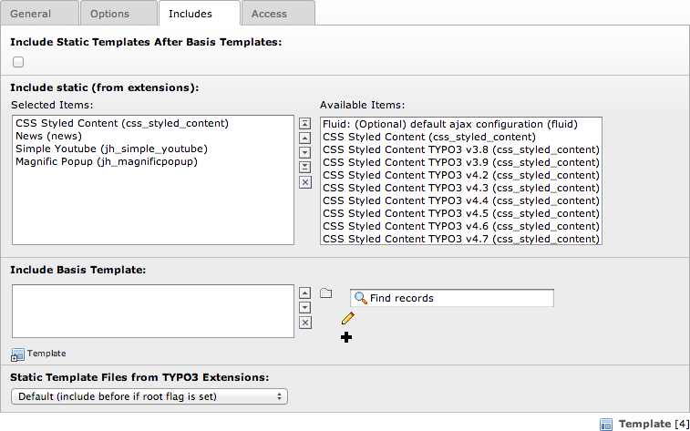

.. ==================================================
.. FOR YOUR INFORMATION
.. --------------------------------------------------
.. -*- coding: utf-8 -*- with BOM.

.. ==================================================
.. DEFINE SOME TEXTROLES
.. --------------------------------------------------
.. role::   underline
.. role::   typoscript(code)
.. role::   ts(typoscript)
   :class:  typoscript
.. role::   php(code)

Lightbox for images
^^^^^^^^^^^^^^^^^^^

To use the lightbox, include static “Magnific Popup
(jh\_magnificpopup)” to your template.

Attention: This Extension uses 'page.jsFooterInline' in TypoScript. If
you use an other extension that uses this command (like
EXT:perfectlightbox or EXT:t3colorbox) make sure you include the
static template of 'Magnific Popup (jh\_magnificpopup)' at last.If you
use EXT:yag\_theme\_magnificpopup the order of these both statics does
not matter.

Now you may customize your extension with the Constant Editor.
